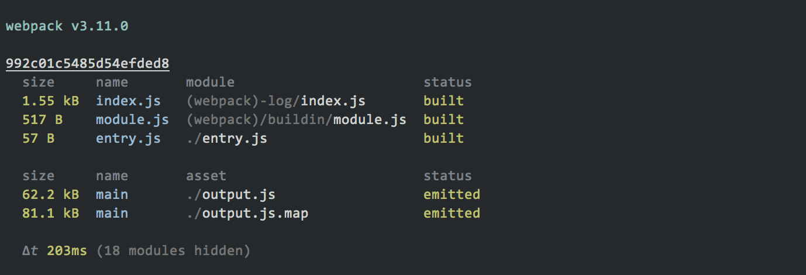

<div align="center">
  <a href="https://github.com/webpack/webpack">
    
  </a>
</div>

[![npm][npm]][npm-url]
[![node][node]][node-url]
[![deps][deps]][deps-url]
[![tests][tests]][tests-url]
[![coverage][cover]][cover-url]
[![chat][chat]][chat-url]

# webpack-stylish

A stylish, opinionated reporter for webpack.



Compared to the default output:


Let's be honest, the default build output for webpack wouldn't exactly hang in
the Louvre. Great tools should have beautiful output. This reporter is
specifically structured to present common, important¹ information about a build
in a visually pleasing and easy-to-read format and style.

¹ _subjective, but based on shared experiences._

## Getting Started

To begin, you'll need to install `webpack-stylish`:

```console
$ npm install webpack-stylish --save-dev
```

Then add the reporter as a plugin to your `webpack` config. For example:

```js
const path = require('path');
const webpack = require('webpack');
const Stylish = require('webpack-stylish');

module.exports = {
  context: path.resolve(__dirname),
  devtool: 'source-map',
  entry: './entry.js',
  output: {
    filename: './output.js',
    path: path.resolve(__dirname)
  },
  plugins: [
    new webpack.NamedModulesPlugin(),
    new Stylish()
  ]
};
```

## Options

There are none! If you're in need of fine-grained control of webpack's build
information out, please don't use this reporter. Instead, you can fine-tune
webpack's default output via the
[`stats` config property](https://webpack.js.org/configuration/stats/#stats).

## Gotchas

The `webpack-stylish` reporter will _straight up ignore_ the `stats` property in
your `webpack` config, if you have one set. This reporter is opinionated.